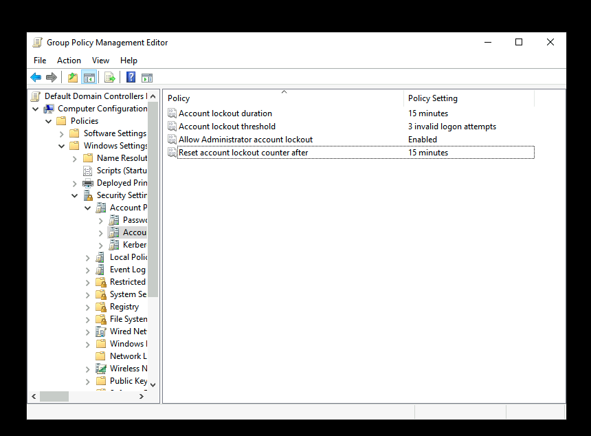
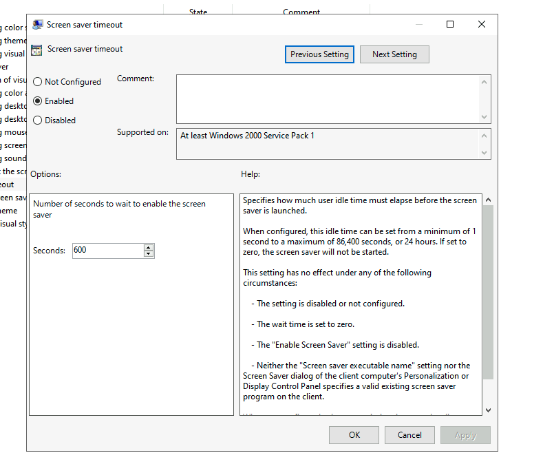
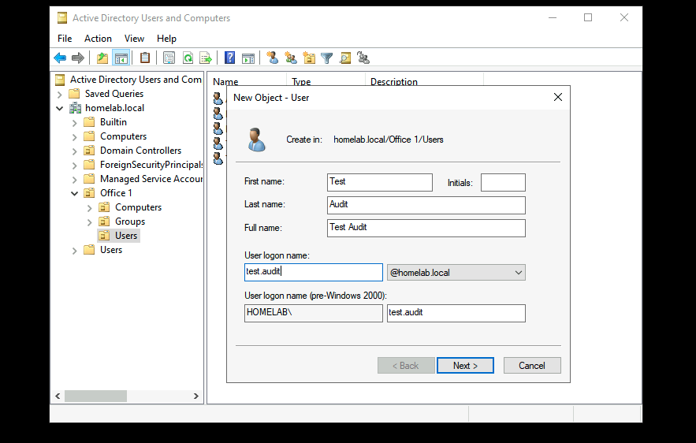
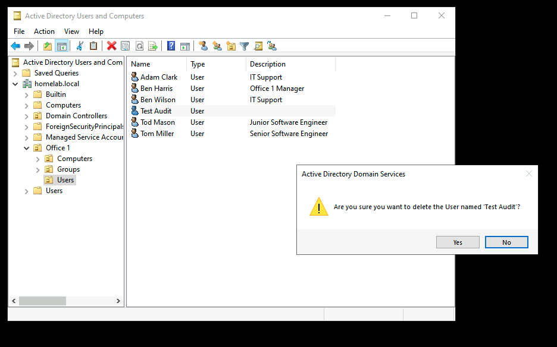
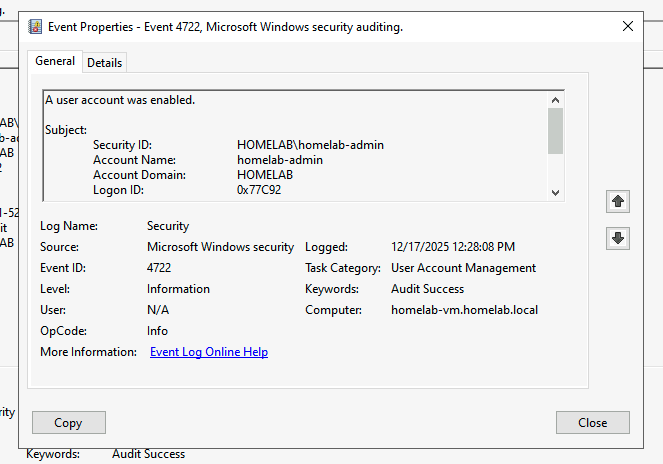
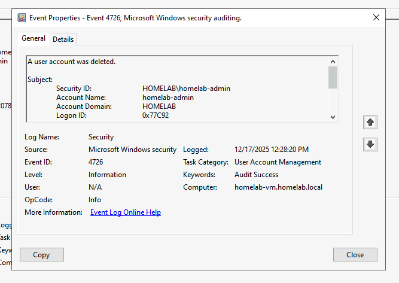
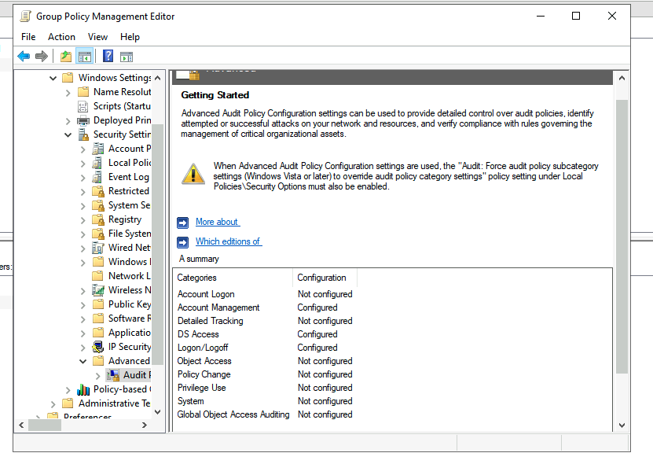
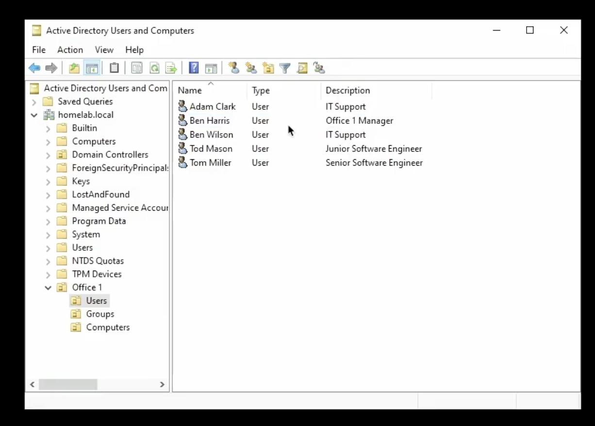

# Active Directory on Azure

## Project Overview

Deployed and configured a Windows Server Active Directory environment on Azure to demonstrate enterprise identity and access management skills. This lab simulates a small business network with organizational structure, user management, security groups, and Group Policy enforcement.

## Technologies Used
- Azure Virtual Machines
- Windows Server
- Active Directory Domain Services (AD DS)
- PowerShell

## Lab Setup
Steps to build the lab:
1. Deployed an Azure Virtual Machine with Windows Server.
2. Installed Active Directory Domain Services.
3. Configured domain users and groups.
4. Created and applied Group Policy Objects (GPOs).
5. Verified domain functionality and connectivity.

## Screenshots
All screenshots are stored in the [AD_Screenshots](AD_Screenshots) folder.

### Users

This screenshot shows the user accounts created in Active Directory and placed
within a dedicated Users Organizational Unit (OU) to improve organisation and
management.

There are multiple ways to create users in Active Directory. One method is to
create a new user directly within the appropriate Organizational Unit (OU),
which is useful when a completely fresh user profile is required.

Another common method is copying an existing user from the same department.
This allows the new user to inherit predefined settings such as group
memberships, ensuring the correct permissions are applied consistently.

Users can also be created using PowerShell, which is typically used for
automation and bulk user creation in larger environments.

This screenshot shows the Active Directory search function, which can be used
to quickly locate user accounts, computers, groups, and other objects within
the domain. While only a few users exist in this lab setup, this tool is
essential in larger environments with hundreds or thousands of objects.

This screenshot shows how to reset a user’s password in Active Directory, a
common task for helpdesk and IT support to maintain account security and
access.

### Groups

Custom security groups organized within the Groups OU for role-based access management.

### Group Policies
In this first GPO i created a password policy where users must follow a certain set of requirements for thier password

In this next screenshot i have created an account lockout policy for users, which is a security policy for the amount of attemps they can enter their password

In this next Group Policy i created a screen timeout policy for users who leave their screens on for too long without activity

### Auditing

In this section i enabled auditing via GPO to track logon events and account management. Event Viewer logs demonstrate successful auditing of test user creation and deletion.

### Domain Structure

Active Directory domain structure showing OU hierarchy and user organization.

## Skills Demonstrated

### Technical Skills
- Active Directory Domain Services (AD DS) deployment and configuration
- Azure Virtual Machine provisioning and management
- Organizational Unit (OU) design and hierarchy implementation
- User account lifecycle management (creation, modification, password resets)
- Security group creation and role-based access control (RBAC)
- Group Policy Object (GPO) configuration and enforcement
- Password policy implementation for security compliance
- Active Directory search and navigation for object management
- Windows Server administration

### Concepts Applied
- Principle of least privilege through security groups
- Role-based access control (RBAC) for permission management
- Hierarchical organizational structure using OUs
- Group-based policy enforcement
- Identity and access management (IAM) best practices

---

## Challenges and Solutions

### Challenge 1: Initial Azure VM Configuration
**Issue:** First time deploying a Windows Server VM on Azure, unsure about optimal VM size and network settings

**Solution:** Researched Azure VM sizing guidelines and selected Standard B2s (2 vCPUs, 4GB RAM) as appropriate for lab environment. Configured network security group rules to allow RDP access while maintaining security

### Challenge 2: AD DS Installation and Promotion
**Issue:** Confusion about DNS configuration during domain controller promotion process

**Solution:** Followed Microsoft documentation to ensure DNS server role was properly installed alongside AD DS. Configured DNS to point to the domain controller's private IP address for proper name resolution

### Challenge 3: Group Policy Not Applying
**Issue:** Created password policy GPO but changes weren't immediately visible on test user accounts

**Solution:** Learned that GPOs require time to replicate and can be forced with `gpupdate /force` command. Also discovered importance of linking GPOs to correct OUs for proper scope of application

### Challenge 4: Organizing Users and Groups Efficiently
**Issue:** Initially created users without proper OU structure, making management difficult

**Solution:** Redesigned OU hierarchy to separate Users, Groups, and Computers under Office 1 OU. This improved organization and made GPO targeting much simpler

---

