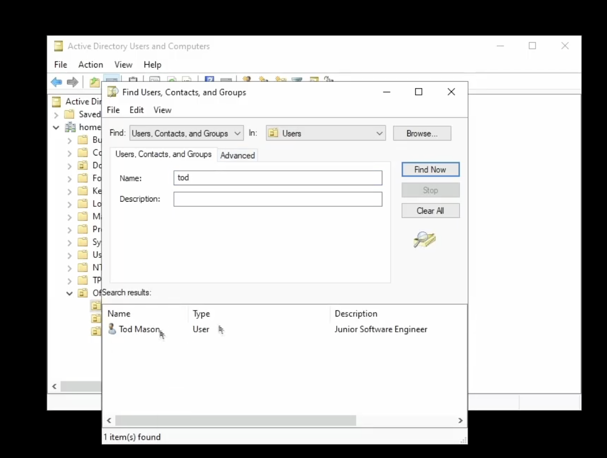
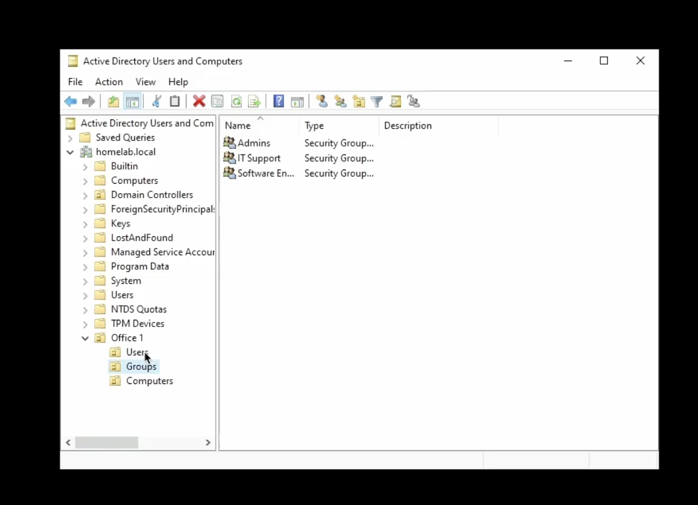
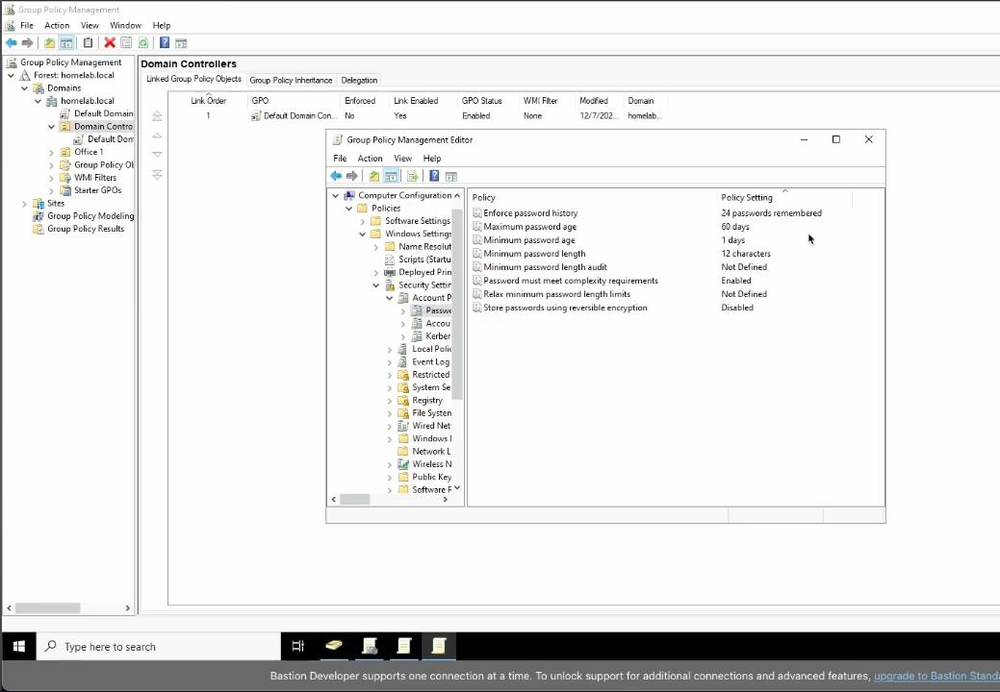

# Active Directory on Azure

## Overview
This project demonstrates an Active Directory lab setup on Azure. It includes configuring domain services, creating users and groups, and applying Group Policy Objects (GPOs) to simulate a small network environment.

## Technologies Used
- Azure Virtual Machines
- Windows Server
- Active Directory Domain Services (AD DS)
- PowerShell (basic scripts)

## Lab Setup
Steps to build the lab:
1. Deployed an Azure Virtual Machine with Windows Server.
2. Installed Active Directory Domain Services.
3. Configured domain users and groups.
4. Created and applied Group Policy Objects (GPOs).
5. Verified domain functionality and connectivity.

## Screenshots
All screenshots are stored in the `AD_Screenshots` folder.

### Users

This screenshot shows the user accounts created in Active Directory and placed
within a dedicated Users Organizational Unit (OU) to improve organisation and
management.

There are multiple ways to create users in Active Directory. One method is to
create a new user directly within the appropriate Organizational Unit (OU),
which is useful when a completely fresh user profile is required.

Another common method is copying an existing user from the same department.
This allows the new user to inherit predefined settings such as group
memberships, ensuring the correct permissions are applied consistently.

Users can also be created using PowerShell, which is typically used for
automation and bulk user creation in larger environments.

This screenshot shows the Active Directory search function, which can be used
to quickly locate user accounts, computers, groups, and other objects within
the domain. While only a few users exist in this lab setup, this tool is
essential in larger environments with hundreds or thousands of objects.

This screenshot shows how to reset a user’s password in Active Directory, a
common task for helpdesk and IT support to maintain account security and
access.

### Groups

Custom security groups organized within the Groups OU for role-based access management.

### Group Policies
In this first GPO i created a password policy where users must follow a certain set of requirements for thier password

### Domain Structure

## Scripts (Optional)
Any scripts used to automate setup can be found in the `Scripts` folder. Example:
- `Create_AD_Users.ps1` – PowerShell script to create domain users

## Lessons Learned / Notes
- Gained practical experience with Active Directory domain setup on Azure.
- Learned to configure users, groups, and GPOs effectively.
- Improved understanding of basic networking and system administration.

## Project Links
- GitHub Repository: [Link to repo]
